# GENJI

<p align="center">
  
</p>

<p align="center">
  <b>Open-source AI manga & image translator</b><br/>
  <i>BYOK. No auth. No credits. No server. Just translate.</i>
</p>

<p align="center">
  <a href="#features"></a>
  <a href="#installation"></a>
  <a href="#installation"></a>
  <a href="#byok"></a>
  <a href="LICENSE"></a>
</p>

<p align="center">
  
  
  
</p>

---

## What is Genji?

Genji is a **free, open-source browser extension** that translates any image on any website using AI. Built as a **reverse-engineered alternative** to commercial manga translators (like Torii Image Translator), Genji removes all authentication, credits, subscriptions, and server middlemen.

**You bring your own API key. You translate unlimited images. For free. Forever.**

### The Difference

| | Torii (commercial) | Genji (open source) |
|---|---|---|
| **Authentication** | Firebase (Google/Apple/email) | None |
| **Credits** | 30 free, then paid | Unlimited |
| **Server** | api.toriitranslate.com | None (direct API calls) |
| **BYOK encryption** | Via Torii server | Local storage |
| **Price** | Subscription | Free |
| **Open source** | No | MIT License |
| **Code** | 33,658 lines | 4,462 lines (clean) |

## Features

### Translation Engine
- **Image detection** -- automatically finds images on any webpage
- **One-click translate** -- click the Genji icon on any image or press `Alt+Shift+Z`
- **OCR + Translation** -- extracts text bubbles, translates, renders on image
- **Inpainting** -- removes original text before rendering translation
- **Context-aware** -- maintains translation context across panels for consistency

### 8 AI Models

| Model | Provider | Notes |
|---|---|---|
| Gemini 3.1 Flash Lite | Google | Fastest, cheapest |
| Gemini 3 Flash | Google | Balanced |
| Gemini 3.5 Flash | Google | Best quality |
| GPT-5.4 | OpenAI | Strong reasoning |
| Claude Sonnet 4.6 | Anthropic | Nuanced translation |
| Kimi K2.5 | OpenRouter | Alternative route |
| DeepSeek Chat | DeepSeek | Cost-effective |
| xAI | xAI | Grok translation |
| Local LLM | Any | Your own endpoint |

### Text Rendering
- **8 warp filters** -- perspective, arc, bulge, squeeze, twist, fisheye, wave, arch
- **18 manga fonts** -- Bangers, BadComic, KomikaJam, Shonen, Bushidoo, Edo, WildWords, and more
- **Auto font sizing** -- adjusts to bubble dimensions
- **Text alignment** -- left, center, right
- **Stroke outline** -- for readability on any background

### Edit Mode
- **Manual text correction** -- fix OCR errors
- **Font customization** -- change font, size, alignment per bubble
- **Warp adjustment** -- fine-tune perspective transforms
- **Undo/redo** -- full history

### Capture Tools
- **Screenshot** (`Alt+Shift+C`) -- capture visible area
- **Screen crop** (`Alt+Shift+X`) -- select region to translate
- **Repeat crop** -- same region as last time
- **Context menu** (`Alt+Shift+D`) -- right-click options

### Performance
- **IndexedDB cache** -- translated images cached locally
- **Chunked messaging** -- handles large images without memory issues
- **Auto-save** -- optionally download translated images automatically
- **No telemetry** -- zero data collection, zero tracking

## BYOK (Bring Your Own Key)

Genji supports **6 AI providers** plus local LLM. Enter your API key once in the popup settings. Keys are stored in `chrome.storage.local` -- never sent to any server.

### Supported Providers

| Provider | Setup | Get API Key |
|---|---|---|
| **OpenRouter** | Paste key in popup | [openrouter.ai/keys](https://openrouter.ai/keys) |
| **Google AI** | Paste key in popup | [aistudio.google.com](https://aistudio.google.com) |
| **OpenAI** | Paste key in popup | [platform.openai.com](https://platform.openai.com) |
| **Anthropic** | Paste key in popup | [console.anthropic.com](https://console.anthropic.com) |
| **DeepSeek** | Paste key in popup | [platform.deepseek.com](https://platform.deepseek.com) |
| **xAI** | Paste key in popup | [console.x.ai](https://console.x.ai) |
| **Local LLM** | Enter URL + model name | Your own server (Ollama, etc.) |

### How BYOK Works

```
Your Browser                    AI Provider
     |                               |
     |-- 1. Detect image             |
     |-- 2. Read BYOK key from       |
     |      chrome.storage.local     |
     |-- 3. Send image + key ------->|
     |      directly to API          |
     |-- 4. Receive translation <----|
     |-- 5. Render on page           |
     |                               |
  NO SERVER. NO AUTH. NO CREDITS.
```

## Installation

### Chrome / Edge / Brave

1. Download the [latest release](https://github.com/dropmoltbot/genji/releases/latest) zip
2. Extract the zip
3. Open `chrome://extensions`
4. Enable **Developer mode** (top right)
5. Click **Load unpacked**
6. Select the extracted `genji` folder
7. Click the Genji icon in the toolbar
8. Enter your API key in the BYOK section
9. Start translating

### Firefox

1. Download the [latest release](https://github.com/dropmoltbot/genji/releases/latest) zip
2. Extract the zip
3. Open `about:debugging#/runtime/this-firefox`
4. Click **Load Temporary Add-on**
5. Select `manifest.json` from the extracted folder
6. Enter your API key in the popup settings

## Quick Start

1. **Set up BYOK**: Click the Genji icon -> Settings -> enter your API key
2. **Choose model**: Select your preferred AI model (Gemini Flash Lite recommended for speed)
3. **Select language**: Choose target language (English, Japanese, Korean, Chinese, etc.)
4. **Translate**: Navigate to any manga/manhwa page, click the Genji icon on an image

### Keyboard Shortcuts

| Shortcut | Action |
|---|---|
| `Alt+Shift+Z` | Translate hovered image |
| `Alt+Shift+C` | Screenshot + translate |
| `Alt+Shift+X` | Screen crop + translate |
| `Alt+Shift+D` | Open context menu |

## Architecture

```
genji/
+-- manifest.json          # Manifest V3
+-- scripts/
|   +-- background.js      # Service worker: API calls, screenshots, downloads
|   +-- content.js         # Content script: image detection, overlay, rendering
|   +-- translationCache.js # IndexedDB cache
|   +-- zip.js            # ZIP utility
+-- popup/
|   +-- popup.html         # Settings UI (BYOK, model, language, fonts)
|   +-- popup.js          # Settings logic
|   +-- popup.css         # Dark geek theme
+-- css/
|   +-- main.css          # Global styles
|   +-- content.css       # Content script styles
+-- html/
|   +-- edit.html         # Edit mode page
+-- images/               # Icons and assets
+-- fonts/                # 18 manga fonts
+-- assets/
|   +-- genji-logo.svg    # Animated logo
|   +-- favicon.svg       # Favicon
```

### File Sizes

| File | Lines | Purpose |
|---|---|---|
| `background.js` | 1,219 | API calls, context menus, screenshots |
| `content.js` | 1,645 | Image detection, OCR, translation rendering |
| `popup.js` | 675 | Settings UI logic |
| `popup.html` | 352 | Settings popup |
| `translationCache.js` | 304 | IndexedDB cache |
| `manifest.json` | 77 | Extension config |
| **Total** | **4,462** | Clean, commented, open source |

## Comparison: Before vs After

### Torii (original commercial extension)

```
User -> Firebase Auth -> Torii Server -> AI API -> Credits deducted
         (login required)   (middleman)    (paid)
```

### Genji (open source)

```
User -> Genji Extension -> AI API (direct) -> Translation rendered
         (no auth)           (BYOK)              (free)
```

**21,287 lines removed** (Firebase SDK). **12,371 lines simplified** (auth/credits/server logic). **4,462 lines kept** (pure functionality).

## Security & Privacy

- **No data collection**: Genji does not collect, store, or transmit any user data
- **No telemetry**: No analytics, no tracking, no reporting
- **Local storage**: API keys stored in `chrome.storage.local` (browser-managed, encrypted at OS level)
- **No server**: All processing happens between your browser and the AI provider
- **Open source**: Full code available for audit

## FAQ

**Q: Do I need an account?**
A: No. Just install, enter your API key, and translate.

**Q: Is it really free?**
A: Yes. The extension is free and open source. You only pay for your own AI API usage (typically fractions of a cent per image).

**Q: Which model should I use?**
A: Gemini 3.1 Flash Lite for speed, Gemini 3.5 Flash for quality, Claude Sonnet for nuanced translations.

**Q: Can I use a local LLM?**
A: Yes. Enter your local LLM URL (e.g., `http://localhost:11434`) and model name in the BYOK settings.

**Q: Does it work on all websites?**
A: Yes. Genji detects images on any webpage and translates them in-place.

**Q: What about CORS?**
A: The extension uses `host_permissions: <all_urls>` to bypass CORS restrictions on image fetching.

## Contributing

Contributions welcome! Areas of interest:

- Additional AI provider integrations
- Improved OCR accuracy
- Better text bubble detection
- More warp filters
- Additional fonts
- Performance optimizations
- UI/UX improvements

### Development Setup

```bash
git clone https://github.com/dropmoltbot/genji.git
cd genji
# Load unpacked in chrome://extensions
# Edit files, reload extension to test
```

## License

[MIT License](LICENSE) -- do whatever you want with it.

## Credits

- **Reverse-engineered and open-sourced by**: [dropxtor](https://github.com/dropxtor) ([@0xDropxtor](https://x.com/0xDropxtor))
- **Original concept**: Torii Image Translator (commercial product, not affiliated)
- **Fonts**: Various manga/comic fonts (see fonts/ directory)
- **AI Providers**: Google, OpenAI, Anthropic, OpenRouter, DeepSeek, xAI

---

<p align="center">
  
  <br/>
  <b>GENJI</b> -- translate everything, own your keys, no strings attached
  <br/>
  <sub>Built by dropxtor. Powered by AI. Free forever.</sub>
</p>
